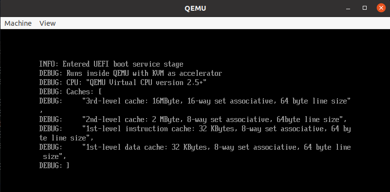

# Build Setup Model to Compile a Kernel for `x86_64`

A compatible [[1]] binary (kernel) which refers to a specification [[1]] that defines the handoff from a bootloader to a payload. It has nothing to do with "multiple OS boot environments"! The binary gets packaged as an `ELF64-x86_64`-file [[2]], that can be loaded 
by `GRUB` [[0]], a`multiboot`-compliant bootloader. The demo project focuses on the **x86_64** processor architecture 
and `UEFI` as firmware environment.


*Screenshot from our kernel running in QEMU. It can fetch some information about it's environment
and print it to the screen. If you boot it on your private computer, it would look similar.*


Although this project could be developed to a fully functional (micro)kernel, this is out of scope of this prototype. It is 
limited to fetch data from `UEFI` firmware and `cpuid` and logging this information to the screen. The main goals 
were to figure out how such a setup could look like and how we could keep developer experience and productivity high. 
For example, to achieve the latter, this repository contains an easy mechanism to start it in `QEMU`.
This project uses `GRUB` + `multiboot2` instead of a custom `UEFI`-loader-app, because at the company
where I developed this prototype, we have a component, that must be loadable by `GRUB`. Therefore it was important
to collect experience, how this can be done in Rust.

## Build Process of the Kernel
The assembly code will do some minimal setup of the stack and other things, before it jumps into the code generated by the Rust compiler. It's the responsibility of 
the Rust code, to cope with the `multiboot2` payload (**multiboot information structure** (*mib*)) and all the system 
setup. The final binary gets completely assembled by `cargo`. We include [global assembly](https://phip1611.de/blog/include-assembler-source-files-in-rust-project-and-build-with-cargo/) 
(i.e., `*.S`-files next to the `*.rs`-files) and use a custom linker script (for `GNU ld`). Therefore, the setup
is similar to several `C`-projects, where also Assembly-Source and High Level-Source are compiled together in one build step.

There is no way this can be achieved without any assembly at all, because some low-level, architecture-specific preparetion
code is always required. At least one needs to configure the stack properly.

## How To Run

When you test this project (`run_qemu.sh`), it will
1) start QEMU + loads `edk2/OVMF` [[3]] as `UEFI`-environment [[4]] 
2) `OVMF` will automatically boot `GRUB` (an EFI file)
3) the `GRUB`-EFI-file has a `grub.cfg` file and the Rust binary built-in into the `GRUB`-internal `(memdisk)`-filesystem.
4) `GRUB` loads the cfg-file which starts the binary


With a boot-order of `firmware > GRUB > %my-binary%`, the binary could take the role of:
* another bootloader (multistage boot)
* an OS-Kernel written in Rust 
* an OS-specific loader which prepares hand-off to an OS-kernel (to decouple large software into smaller blocks of responsibility)

---

### Software/Tool versions 
#### Required Packages & Tools
- `rustc` and `cargo` (e.g. via `rustup`)
- `gcc` for global assembly files
- `ovmf` (for testing in `QEMU` only)
#### Notes
- I tested the built on an Ubuntu 20.04 system with Linux 5.8.0
  - probably doesn't build on other operating systems than Linux (not tested)
- because of the file`rust-toolchain.toml` `cargo` will use the correct compiler
  version by default
- "run in QEMU"-demonstration tested with
  - **GRUB**: 2.04-1ubuntu26.1
  - **QEMU**: 4.2.1
  - `OVMF` files are searched in `/usr/share/OVMF`

---


#### Getting Output (in QEMU) & Debug
It's not completely trivial to get output in this early stage of the boot.
Luckily, `QEMU` helps us. 

##### Output & Debug A: Change Register Values and `halt`
You can write a value into a register and `hlt` (stop the processor). In the QEMU GUI, you can open 
`View > compatmonitor0` and type `info registers`- you should see the register values!
Use this code for example:

```rust
unsafe { asm!("mov edi, {val}", "cli", "hlt", val = const 0x0bad_f00d_u32) };
```

##### Output & Debug B: Use QEMUs 'debugcon' Feature
On `x86[_64]` one can the `I/O-port 0xe9` to write data, for example
ASCII to the outer world. QEMU can capture this into a file. See
this [blog post for more details](https://phip1611.de/blog/how-to-use-qemus-debugcon-feature-and-write-to-a-file/).

---


